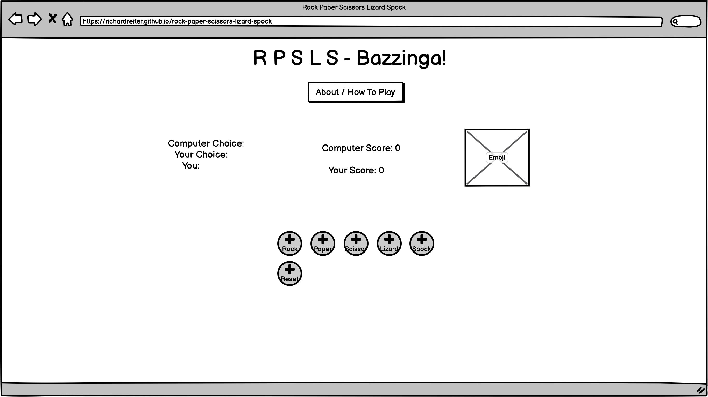
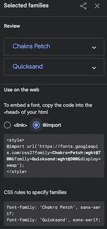
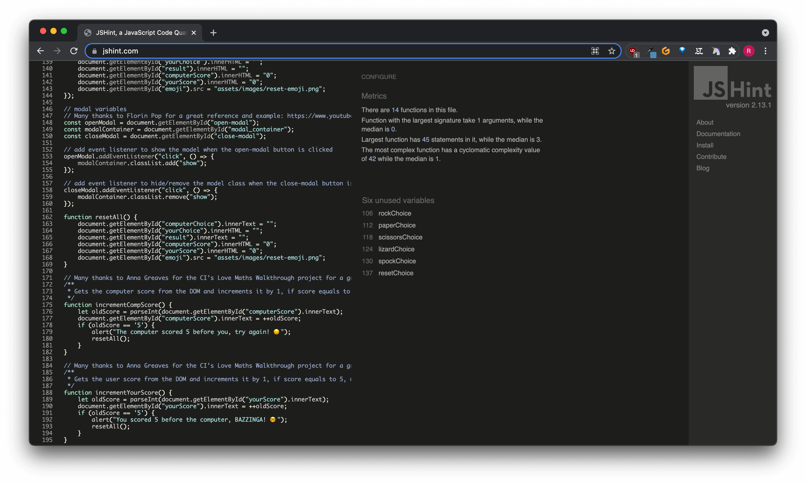
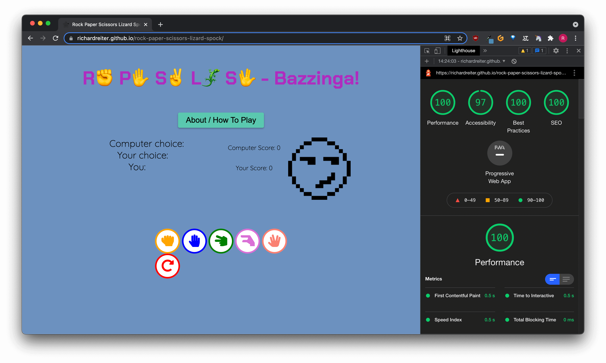
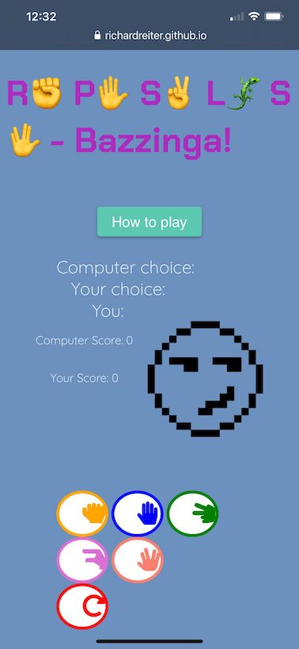

# Rock, Paper, Scissors, Lizard, Spock Game

[Rock Paper Scissors Lizard Spock](https://richardreiter.github.io/rock-paper-scissors-lizard-spock/) is a website hosting a web based game invented by [Sam Kass & Karen Bryla](http://www.samkass.com/theories/RPSSL.html). This game was popularised by the American TV sitcom [The Big Bang Theory](https://youtu.be/x5Q6-wMx-K8), as an improvement of the classic Rock Paper Scissors game.
The Lizard and Spock addition is meant to give the game a twist and make it more fun/exciting.

The player will test their luck against the computer, making a choice of their weapon in each round - Try and beat the computer, first to reach 5 points wins!

Visit the live project [here.](https://richardreiter.github.io/rock-paper-scissors-lizard-spock/)

## UX (User Experience)

### Project Goals

- Create a clean, simple one page website to showcase a classic fun game (with a twist).
- Provide the user/player with instructions/rules on how to play the game.
- Provide feedback to the user on each round via a score tally.

### Target Audience

- People of all ages.
- Anyone who wants to have a bit of fun with a game of chance.

### User Stories

- As a user, I want to understand what the website is about.
- As a user, I want to know how to play the game.
- As a user, I want to know the game's rules.

### Wireframes

The mockups below were done with the help of Balsamiq (for both desktop and mobile screens), these were useful to help visualise the project.

- Desktop:
  

- Mobile:
  

### Design

- The colour scheme was generated with [Coolors.](https://coolors.co/af2bbf-a14ebf-6c91bf-5fb0b7-5bc8af)

- [Google Fonts](https://fonts.google.com/) was used for the website's fonts, some inspiration on the choice of fonts (Chakra Petch & Quicksand) came from [mixed ideas of this blog post](https://artisanthemes.io/best-google-fonts-combinations-modern-agency-website/) and also [this site.](https://www.whatfontis.com/NMY_BigBang.similar)

## Features

### Existing Features

- 

### Features Left to Implement

- 

## Technologies Used

### Languages Used

- [HTML5](https://developer.mozilla.org/en-US/docs/Glossary/HTML5)
- [CSS3](https://developer.mozilla.org/en-US/docs/Web/CSS)
- [JavaScript](https://developer.mozilla.org/en-US/docs/Web/JavaScript)

### Frameworks, Libraries & Programs Used

- [Balsamiq](https://balsamiq.com/)
  - Balsamiq was used to make desktop/mobile mockups in order to visualise the project.
- [Git](https://git-scm.com/) & [Gitpod](https://gitpod.io/)
  - Git was used for version control via the Gitpod terminal in order to commit to Git and push to GitHub.
- [GitHub](https://github.com/)
  - GitHub was used for hosting the project and version control.
- [Google Fonts](https://fonts.google.com/)
  - Google Fonts was used to import the fonts which are used on the website.
- [Font Awesome](https://fontawesome.com/)
  - Font Awesome was used to add icons to improve the design of the website.

## Testing

### Testing User Stories from User Experience (UX) Section

- 

### Validator Testing

- HTML
  - No errors/warnings were returned when passing through the official [W3C validator](https://validator.w3.org/nu/?doc=https%3A%2F%2Frichardreiter.github.io%2Frock-paper-scissors-lizard-spock%2Findex.html)

  

- CSS
  - No errors were found when passing through the official [(Jigsaw) validator](https://jigsaw.w3.org/css-validator/validator?uri=https%3A%2F%2Frichardreiter.github.io%2Frock-paper-scissors-lizard-spock%2Fassets%2Fcss%2Fstyle.css&profile=css3svg&usermedium=all&warning=1&vextwarning=&lang=en)

  

- JavaScript
  - No warnings were returned when passing through [JShint code quality tool](https://jshint.com/)

  

### Google Lighthouse

- Google's Lighthouse was used for measuring the quality of the pages.
  - Index Page (desktop) result:
  

  - Index Page (mobile) result:
  

### Responsive Testing

- __[Am I Responsive?](http://ami.responsivedesign.is/)__
  - This design tool was used to show how responsive the website is and looks across 4 different viewports (Desktop, Laptop, Tablet and Mobile):

### Device Testing

- The Rock Paper Scissors Lizard Spock game website was tested on several devices/environments (without any issues), including:
  - MacBook Air 13.3" M1 2020 (macOS Big Sur 11.5.2)
  - i5 Desktop PC (Windows 10 64x)
  - iPhone 11 Pro Max (iOS 14.8)
  - Xiaomi Mi A3 (Android 11)
  - Google Pixel 4a (Android 11)

### Browser Testing

- The Rock Paper Scissors Lizard Spock website was tested on several browsers (without any issues, but Safari on iPhone 11 Pro Max - please see "Unfixed Bugs" section below), including:
  - Google Chrome (Version 94.0.4606.81 (Official Build) (arm64))
  - Mozilla Firefox (93.0 (64-bit))
  - Safari (Version 14.1.2 (16611.3.10.1.6))
  - Microsoft Edge (Version 94.0.992.50 (Official build) (64-bit))
  - Brave (Version 1.30.89 Chromium: 94.0.4606.81 (Official Build) (arm64))
  - Vivaldi (4.1.2369.21 (Stable channel) (arm64))

### Fixed Bugs

- The emoji state image disappeared from the live site once the website was deployed:
  - I hadn't noticed I was using a wrong file path for that image in particular, once I deployed the site I couldn't see that image in particular - this was fixed once I changed the file path.

### Unfixed Bugs

- Buttons look streched on iPhone 11 Pro Max (iOS 14.8) Safari 14:
  - When testing the website, for some reason there's a bug with the buttons' designs only found on that iPhone device and browser in particular:

- 

## Deployment

- The website was deployed to GitHub pages, the steps were: 
  1. Log into my GitHub account.
  2. Select the relevant repository from the far left menu [richardreiter/rock-paper-scissors-lizard-spock](https://github.com/richardreiter/rock-paper-scissors-lizard-spock)
  3. Select the "Settings" option.
  4. Hover down to the GitHub pages section heading.
  5. See the text: "Pages settings now has its own dedicated tab! Check it out here!" (click on "[Check it out here!](https://github.com/richardreiter/rock-paper-scissors-lizard-spock/settings/pages)").
  6. Select "main" under Source Branch.
  7. Click "Save"
  8. A success message appears stating the site has been published at https://richardreiter.github.io/rock-paper-scissors-lizard-spock/

## Credits

### Content

- The button icons were taken from [Font Awesome.](https://fontawesome.com/)
- Font inspiration ideas were taken from [this blog post](https://artisanthemes.io/best-google-fonts-combinations-modern-agency-website/) and also [this site.](https://www.whatfontis.com/NMY_BigBang.similar)
- The color scheme was generated with [Coolors.](https://coolors.co/af2bbf-a14ebf-6c91bf-5fb0b7-5bc8af)
- Emojis used throughout the game were found [via Emojipedia.](https://emojipedia.org/)
- Many thanks to Anna Greaves for the [CI’s Love Maths Walkthrough project](https://github.com/Code-Institute-Solutions/love-maths-2.0-sourcecode) for a great reference, inspiration and example for buttons.
- Many thanks to [Polkagris](https://github.com/Polkagris/rock-paper-scissors-vanillaJs_v2)/[Red Eye Media](https://www.youtube.com/watch?v=WtSiG2DNF9k) for a great reference and example of the emoji state.
- Many thanks to [Florin Pop](https://www.youtube.com/watch?v=XH5OW46yO8I) for a great reference and example of a modal.

### Media

- The website [favicon.io](https://favicon.io/) was used to convert an image into a favicon.
- The website [tinypng.com](https://tinypng.com/) was used to compress the images.
- Many thanks to [tulpahn](https://icon-icons.com/pack/Emoji-Pixel/3044) for the Emoji Pixel pack images used for the emoji state images.

### Other

- Many thanks to my mentor, Gerry McBride, for his guidance and feedback.